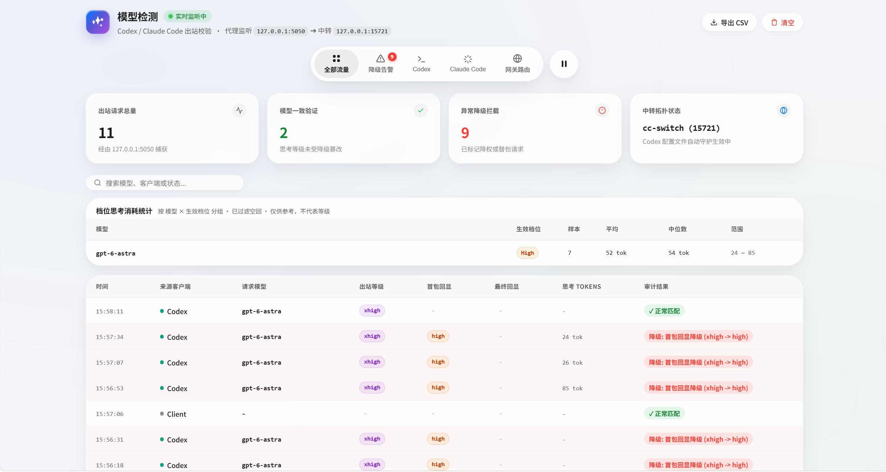

# 🛡️ AI Reasoning Monitor

A lightweight audit proxy designed specifically for **Claude Code** and **Codex** alongside **cc-switch**. It determines whether **reasoning effort (thinking intensity) has been silently downgraded** by inspecting server response payloads.

> ⚠️ **Note**:
> 1. This tool **does NOT detect or verify model identity**. Downgrade judgment compares only the server-echoed effort level against the requested level.
> 2. Reasoning is dynamic: at any effort level a simple prompt may think only briefly. Token counts are therefore reported for statistics only and are never used to infer a level.
> 3. Requires locally running **cc-switch** (designed specifically for Claude Code & Codex).

---

## 📸 Dashboard Preview



---

## 🧐 What Does It Do?

When routing through 3rd-party API relays, high reasoning effort requests are sometimes silently weakened. This tool runs on local port `5050` to inspect:

1. **Extract Client Request**: Captures the requested effort (e.g. `reasoning_effort: xhigh/high`, thinking budget).
2. **Sniff Server Response**: Extracts the actual echoed effort from streaming chunk 0 and the final `reasoning_tokens` in the usage chunk (accumulated `thinking_delta` chars for Anthropic).
3. **Thinking-Consumption Statistics**: Groups actual thinking tokens by model × effective level (count, average, median, range; empty responses filtered) for reference only.
4. **Downgrade Alerts**: Compares the two; if the returned reasoning intensity is lower than requested, it raises an instant visual/audio alert in the Web console and terminal.
5. **cc-switch Daemon**: Automatically preserves Codex port mappings when switching routes in cc-switch.

---

## 🚀 How to Use?

### Prerequisite
**cc-switch** must already be running locally (default port `15721`).

### 1. Start the Monitor
Double-click:
```bat
start_monitor.bat
```
> Starts the proxy and opens the Web console: `http://127.0.0.1:5050`.  
> *(Or via CLI: `pip install -r requirements.txt && python monitor_server.py 5050`)*

### 2. Client Setup

- **Option A: One-Click Environment Binding (Recommended)**  
  Double-click **`bind_env.bat`**; run **`unbind_env.bat`** anytime to restore direct connection.
- **Option B: Manual Setup**  
  - **Claude Code**: Set `ANTHROPIC_BASE_URL=http://127.0.0.1:5050`
  - **Codex**: Set Base URL to `http://127.0.0.1:5050/v1` (auto-syncs with cc-switch)

---

## 📦 Build Standalone Executable (.exe)

Double-click **`build_exe.bat`** to generate `dist\ModelMonitor.exe` (no Python required).

---

## 📄 License

[MIT](LICENSE)
